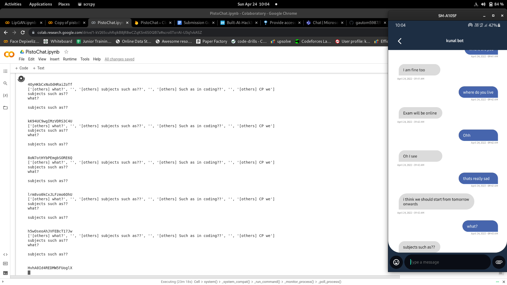

# PistoChat

## Introduction:

- There are times when we want to text/video chat our closed ones but they are busy or internet is not proper so our chatting application PistoChat enables the user to Text Chat and Video Chat even if the other person is offline or can't talk, provided the other user has consented:

    - to make use of chat history for training of NLP model which will enable the user to chat with a bot version of other user which will act as a substitute for other user
    - to make use of profile picture and chat history for video message generation/video chat using GAN then the user will be able to get video messages from the other user

- The user won't be conversing for real with the other user but with our bot created using pre-trained GPT-2 and LipGAN that will enable the bot to talk and act like the user in most indistinguishable way possible provided the conversing parties have enough data for proper training of the models.

_Unfortunately Video Chat feature could not be implemented in the app due to time constraints_

## Screenshots:

> Screenshot depicting a bot replying to user messages and its working in the background.

## Presentation Link:
  <a href="https://docs.google.com/presentation/d/1Ln1oz20AXF9c20YrELCqE8yrF1eJYiddyvqjVt4EfGw/edit?usp=sharing">Presentation Link</a>

## Technology Stack:
  1) Android SDK (Java)
  2) Firebase
  3) Google Colab 
  4) PyTorch for NLP Transformer (Pretrained)
  5) Tensorflow for GAN (Pretrained)

## Contributors:

Team Name: 0xCAFEBABE

* [Gautom Agarwal](https://github.com/gautom5987)
* [Kunal Katiyar](https://github.com/kunal2812)
* [Shashank Shekhar](https://github.com/shashank8987)

## License:

MIT

